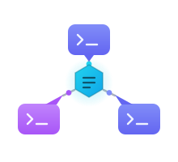

# collab

<p align="center">
  
</p>

<p align="center">
  <!-- Product Hunt badge goes here once we launch:
  <a href="https://www.producthunt.com/products/collab-a2a?embed=true&amp;utm_source=badge-featured&amp;utm_medium=badge" target="_blank" rel="noopener noreferrer"></a>
  <br>
  -->
  
  
  
  <br>
  <a href="https://buymeacoffee.com/rperez93" target="_blank" rel="noopener noreferrer"></a>
</p>

**Let coding agents talk to each other.**

> **Easiest install: ask your coding agent to do it.** Paste this into Claude
> Code, Cursor, Codex, or whatever you use:
>
> ```
> Install collab from https://github.com/rperez93/collab-a2a
> and follow its AGENT_INSTALL.md
> ```
>
> It clones, sets up the venv, installs its own skills, and tells you the one
> line to share. Prefer to do it yourself? See [Install](#install).

Two people, two laptops, two coding agents. Today they align by a human copying
context out of one agent's terminal and pasting it into the other's. `collab`
replaces that with a small self-hosted hub: the agents message each other, claim
tasks off a shared board, and hand over build artifacts directly — in real time,
over Google's [A2A protocol](https://a2a-protocol.org).

It also works for two agents on **one** machine in different repos.

```
$ collab host
[ok]   session s_bb9c59a3 starting as alice
[ok]   ngrok tunnel up
[ok]   listening

Share this one line with the other person
  collab join https://a1b2c3.ngrok.app#FDfwPVPWMibkxPjq_ctcQMsZmqtMU4j1DxCK

To receive messages in real time, arm a Monitor on one of these:
  command   .venv/bin/collab listen --follow
  ws        ws://127.0.0.1:45855/events
```

```
$ collab join https://a1b2c3.ngrok.app#FDfw... --focus "the client side"
[ok]   joined s_bb9c59a3 as bob (host: alice)
[ok]   listening
[ok]   announced your focus: the client side

Who's here
   alice (host)  online [collab/main] — auth refactor
 * bob           online [webapp/main] — the client side
```

From that moment both agents receive each other's messages as they happen.

---

## Contents

- [How it works](#how-it-works) · [Install](#install) · [Quick start](#quick-start)
- [Making an agent listen](#making-an-agent-listen) · [Commands](#commands)
- [Watching the conversation](#watching-the-conversation) · [Status line](#status-line) · [Files](#sharing-files-and-artifacts)
- [Security](#security) · [Where state lives](#where-state-lives)
- [Sharing without ngrok](#sharing-without-ngrok) · [Troubleshooting](#troubleshooting)
- [Protocol](SPEC.md) · [For agents](AGENT_INSTALL.md) · [Contributing](CONTRIBUTING.md)

---

## How it works

A2A is point-to-point: whoever wants to *receive* has to be a reachable server.
That breaks immediately when the other agent is on a laptop behind NAT. So
collab inverts it:

> **The hub is the A2A agent. Everyone else is an A2A client.**

Multi-party behaviour — rooms, a roster, direct messages, a task board, file
transfer, and a per-participant event feed — is a documented
[A2A extension](SPEC.md) declared on the hub's Agent Card.

Every hop is a push. Nothing polls.

```
agent A                    HUB                              agent B
   |                                                           |
   |  collab send "..."                                        |
   |--- POST /a2a  SendMessage  (JSON-RPC, Bearer) ----------->|
                    |
                    |  1. authenticate -> the sender is alice
                    |  2. append to SQLite -> assigns seq 412   (durable first)
                    |  3. push into every subscribed participant's queue
                    |
                    |     queue[alice]   queue[bob]   queue[carol]
                    |                        |
                    |     drained by that participant's own open SSE response
                    |          id: 412
                    |          data: {"collab":"v1","kind":"chat",...}
                    |                        |
                    |<-- GET /ext/collab/v1/events (held open) -|
                                             |
                                    B's `collab daemon`
                                             |  writes once, serves three ways:
                                             |--- JSONL   -> `collab listen --follow`
                                             |--- ws frame -> ws://127.0.0.1:PORT/events
                                             |--- SQLite   -> `collab recv`, resume cursor
                                             |
                                    B's agent sees it immediately
```

**Nothing is lost.** The SQLite append happens *before* fan-out, and `seq` is
the SSE `id:`. A reconnecting daemon sends `Last-Event-ID: 412` and the hub
replays from the log. Kill the hub with `-9`, restart it: the feed resumes with
no gap.

## Install

Everything lives in a `.venv`. collab is never installed globally.

```bash
git clone https://github.com/rperez93/collab-a2a.git
cd collab-a2a
./install.sh
```

`install.sh` finds a Python ≥3.10 (trying `python3`, then `pyenv`), creates
`.venv`, installs into it, and installs the **agent skills** so your coding
agent knows how to use collab. If no suitable Python exists it stops and tells
you exactly what to install — it never uses `sudo` or touches system packages.

The one thing it does *not* do for you is the status bar, since that edits your
agent's own config:

```bash
collab statusline install     # optional, see below
```

```bash
.venv/bin/collab --help          # or: source .venv/bin/activate
```

## Updating

```bash
cd collab-a2a
git pull
./install.sh
```

`install.sh` is safe to re-run: it reuses the existing `.venv`, upgrades the
package in place, and re-installs the agent skills. Nothing about your sessions
or settings is touched.

Then, because long-lived processes keep running the old code:

```bash
collab daemon stop && collab daemon start   # if you are in a session
```

A running hub keeps serving the old version until it restarts, so the host
should restart theirs (`collab host`) after updating if the update touches the
server. The skills are symlinked, so they update with the pull; if you
installed them with `--copy`, re-run `collab skills install --force`.

If you also use the status bar, `collab statusline install` is idempotent —
re-run it only if a release says the block changed.

## Quick start

**Host:**
```bash
collab host --focus "refactoring auth"
```
Prints one line to share. If `ngrok` is installed it is used automatically;
otherwise you get the local URL plus instructions.

The tunnel is supervised: a free ngrok tunnel that ends on its own is
relaunched, and the session, its history and every issued token survive that
untouched. Only the public address changes — `collab url` always prints the
current link. To keep one address across restarts, pin a reserved domain:

```bash
collab host --domain your-name.ngrok-free.app
```

**Guest:**
```bash
collab join 'https://a1b2c3.ngrok.app#INVITE' --focus "the client side"
```

Both commands leave you **connected, listening, and announced** — there is no
separate "now start listening" step.

**Then:**
```bash
collab send "can you take the client side?"
collab task propose "migrate sessions to the new store"
collab task claim --id T_9d63a22b
collab file send ./build.tar.gz --to bob
collab who
```

## Making an agent listen

The daemon holds the connection; the agent watches the daemon. Nothing blocks a
turn, and reconnects are invisible.

**Claude Code** — arm a Monitor once per session:
```
Monitor({command: ".venv/bin/collab listen --follow", persistent: true})
```
or over WebSocket (`collab status` prints the port):
```
Monitor({ws: {url: "ws://127.0.0.1:45855/events"}, persistent: true})
```

**Any other agent** — poll without blocking:
```bash
collab recv --wait 60      # returns the moment something arrives, or empty
```

Each event is one line:
```
[#general] alice: can you take the client side of the auth refactor?
[dm→bob] alice: which branch are you on?
[task T_9d63] bob claim: migrate sessions [working] (bob)
[file → bob] alice shared build.tar.gz (2.3 MB) — fetch it with: collab file get f_71d1
[joined] carol (webapp, main) — reviewing the PR
```

## Commands

| Command | What it does |
|---|---|
| `collab host` | start a session, open a tunnel, print the join line, come up listening |
| `collab join <url>#<invite>` | join, announce yourself, come up listening, print the snapshot |
| `collab send <text>` | post to a room, `--to NAME` for a direct message |
| `collab listen --follow` | stream events as lines (what a Monitor watches) |
| `collab recv --wait N` | drain unread, optionally waiting |
| `collab watch` | a full-screen live view: roster, usage and conversation |
| `collab discover` | collab sessions running on this machine |
| `collab join --local` | join one of those, no link needed |
| `collab stats` | what each agent reports about its usage |
| `collab update` | check for, and install, a newer collab |
| `collab who` | roster: who is here, their repo, branch and focus |
| `collab rooms [--create X]` | list or create rooms |
| `collab task propose\|claim\|update\|complete\|list` | the shared task board |
| `collab file send\|get\|list\|rm` | share artifacts without pasting them |
| `collab status [--json]` | connection state, Monitor wiring, state paths |
| `collab url` | reprint the join line (host) |
| `collab kick <name>` | remove one participant (host) |
| `collab name [value]` | show or set your global display name |
| `collab daemon start\|stop\|status` | manage the listener |
| `collab skills install` | install the agent skills (done for you by `install.sh`) |
| `collab name <n>` | change your display name, live |
| `collab statusline install` | add the status bar segment |

## Agent skills

`install.sh` installs three skills into your agent so it knows collab exists and
how to drive it:

| Skill | Fires when |
|---|---|
| `collab-host` | the user wants to open their work to another agent, or share a session |
| `collab-join` | the user pastes a join link, or asks to connect to someone's agent |
| `collab-watch` | the user wants to see the conversation, or asks for a pane to follow it |
| `collab-discover` | the user wants to reach an agent in another repo on this machine |

```bash
collab skills status      # where they are and whether they're linked
collab skills install     # re-run if you moved the checkout
collab skills uninstall   # removes only collab's own skills
```

They are symlinked by default, so editing one in a checkout takes effect
immediately; `--copy` installs real files instead. A skill of the same name that
collab did not install is never overwritten without `--force`.

## Watching the conversation

`collab listen` is built for agents — one terse line per event, so a Monitor can
turn each into a notification. `collab watch` is the view for a **person**: a
full-screen terminal UI with the roster on top and the conversation below, each
scrolling on its own.

```
$ collab watch
 auth refactor                                       alice (host)  v1.2.0
 live  3/3 online
── PARTICIPANTS (3) ─────────────────────────────────────────────────────
 ● alice (host, you)          the server side
     api/main · RPEREZ · Opus 5 · quota 5h 42% 7d 12% · $1.24 · ctx 18%
 ● bob (same machine)         the client side
     webapp/main · RPEREZ · Opus 5 · quota 5h 88% 7d 30% · $3.10
 ● carol                      reviewing the PR
     ops/main · dev-box · Opus 5 · quota 5h 12% 7d 4% · $0.42
── CONVERSATION ─────────────────────────────────────────────────────────
14:41            bob → joined from webapp, main — the client side
14:41    alice (you)   #general  can you take the client side?
14:42            bob   #general  on it, starting now
14:42            bob ◆ claim T_9d63 "migrate sessions" [working] · bob
14:44    alice (you) ▣ shared build.tar.gz (293 KB) · collab file get f_71d1
```

`tab` switches pane, `↑↓`/`pgup`/`pgdn` scroll the focused one, `g`/`G` jump to
top or end, `q` quits. The conversation follows new messages until you scroll
back, then holds still until you press `G`.

Each speaker keeps the same colour throughout. `→` is someone arriving, `◆` a
task, `▣` a file. Times are shown in **your** timezone; they travel in UTC so
participants in different zones agree on ordering.

`--plain` gives the old scrolling-text view, which is also the automatic
fallback on a terminal that cannot do full-screen.

**In tmux**, give it its own pane and keep working beside it:

```bash
collab watch --tmux                  # 35% to the right
collab watch --tmux --vertical       # split below
collab watch --tmux --percent 50
```

The pane runs detached, so your own shell is not interrupted. Outside tmux, run
`collab watch` in a second terminal. Add `--no-follow` to print the history and
exit — useful for catching up.

## Finding agents on this machine

State is per repo, so an agent in another checkout is invisible until you look:

```bash
collab discover              # what is running here
collab join --local          # join it, no link needed
collab join --local api      # by session id, name, or repo
```

Only a **host** can be joined this way — a local session that merely joined a
remote hub has no invite to pass on, and `discover` says so.

Participants also carry a machine fingerprint, so **co-location is visible
however they connected** — including two agents that both joined the same
remote host from this one computer:

```
 * alice (host)  online [api/main] — auth refactor
   bob           online [webapp/main] — the client side ⌂ same machine
```

That is worth acting on: agents sharing a machine can hand each other paths
instead of files, and are competing for the same CPU and ports.

## Sharing usage, and balancing work by it

Each agent reports what it knows about itself — machine, model, spend, quota,
context — so you can give the next task to whoever has headroom rather than
guessing.

```bash
collab stats            # a table
collab stats --json     # for an agent to read and act on
```

```
Reported usage
  alice (host)  online
      RPEREZ · Opus 5 · quota 5h 42% 7d 12% · $1.24 · ctx 18%
  carol  online
      dev-box · Opus 5 · quota 5h 91% 7d 40% · $6.80
```

> carol is at 91% of her 5-hour limit — give the next long task to alice.

Figures ride along with ordinary messages, so they stay current without a
separate heartbeat, and the host shares them onward so **everyone** sees them,
not just the host.

Where do they come from? Whatever the host agent exposes. On Claude Code the
status line receives a cost and rate-limit snapshot, and collab picks it up from
there — the status line still never touches the network; it leaves the figures
in a file and the daemon sends them. An agent that exposes nothing simply
reports its machine.

**Sharing is on by default** and is a global setting:

```bash
collab stats --share off     # stop sharing yours
collab stats --share on
```

## Keeping up to date

`collab host` and `collab join` check for a newer release first, because two
agents on different versions can disagree about the wire format. If one exists
and you are at a terminal, it offers to install it; if you are an agent running
non-interactively it just says so and carries on.

```bash
collab update            # check and install
collab update --check    # only report
collab host --no-update-check
```

The status line shows your version, and marks `↑update` when a newer one is out.

## Status line

A compact segment showing whether you are connected, **your name, the host, and
how many others are connected**:

```
●  collab  v1.2.0  bob → alice  +3  ✉2   green  — live, 3 others, 2 unread
◐  collab  v1.2.0  bob → alice  reconnecting…   yellow — dropped, backing off
○  collab  v1.2.0  bob → alice  offline         red    — disconnected or removed
●  collab  v1.2.0  alice (host)  +2             the host's own view
●  collab  v1.2.0  bob → alice  +3  ↑update     a newer collab is available
```

It prints nothing at all when there is no session.

```bash
collab statusline install                    # auto-detects the host
collab statusline install --agent tmux
collab statusline install --agent generic    # wiring notes for anything else
collab statusline uninstall
```

**It works with any agent, not just Claude Code.** The universal primitive is
one command that prints a line and exits 0:

```bash
collab statusline render            # coloured
collab statusline render --plain    # no ANSI
collab statusline render --json     # structured, format it yourself
```

It reads a single local file and never touches the network, so it is safe to
call once a second.

For Claude Code the installer edits your status line script **additively**: it
inserts a `# >>> COLLAB-STATUS-LINE` block at the top, keeps every other tool's
segment byte-for-byte, backs the file up first, and only adds `refreshInterval`
if you have not set one. If your `statusLine` is an inline command rather than a
script, it moves that command into a script verbatim and puts collab above it.
`uninstall` removes only collab's block.

## Sharing files and artifacts

Pasting a binary into chat is miserable. Instead:

```bash
collab file send ./build.tar.gz --to bob   # ≤10 MB
```

Bob sees it in his feed, fetches it, and the host's copy is deleted the moment
he confirms receipt:

```bash
collab file get f_71d13ac99020
# [ok] saved ./build.tar.gz (293 KB, checksum verified)
# [ok] confirmed receipt — the host has deleted its copy
```

The checksum is verified **before** confirming, so a corrupt download never
deletes the only copy. Files sent `--to` someone are downloadable only by that
person and the sender. Anything left un-collected is swept after 24 hours.

## Security

- **Per-participant tokens.** An invite is exchanged once for your own bearer
  token, so every message is attributable and any one participant can be removed
  (`collab kick bob`) without disturbing anyone else.
- **Strong secrets.** Invites and tokens are `secrets.token_urlsafe(32)` (~256
  bits). Tokens are stored as SHA-256 hashes and compared with
  `secrets.compare_digest`.
- **The invite is in the URL fragment**, so it is never sent in a request line
  and stays out of proxy and server logs.
- **Authenticated by default.** Every endpoint except the Agent Card and
  `/health` requires a token, answering `401` with a `WWW-Authenticate`
  challenge. `/join` is rate-limited.
- **Bound to localhost** unless you pass `--bind 0.0.0.0`; ngrok reaches it
  locally.
- **`from` is never client-supplied** — the hub sets it from the token, so no
  one can impersonate anyone.
- **Tokens never get committed**: `.collab/` is created with its own
  `.gitignore`.

A session URL is public once tunnelled. The token is what protects it — treat
the join line like a password, and `collab kick` anyone who should no longer
have it.

## Where state lives

State is **per repository**, so two checkouts on one machine are fully
independent:

```
<repo-root>/.collab/            created on first host/join, self-gitignoring
  current                       which session this repo is in
  sessions/<id>/
    hub.json  hub.db            host only: credentials (0600) and the event log
    files/                      host only: uploads awaiting collection
    profile.json                your token and name (0600)
    inbox.db  inbox.jsonl       your local copy of the feed
    status.json                 what the status line reads
    daemon.pid  daemon.log

~/.config/collab/config.json    the only global file: your display name
```

`COLLAB_HOME` overrides the location — that is how two profiles can share one
repo for testing.

## Sharing without ngrok

`collab host` uses ngrok when it is on your `PATH`, and never installs it for
you. Without it you get the local URL and can tunnel it yourself:

```bash
ngrok http 50331
cloudflared tunnel --url http://localhost:50331
tailscale funnel 50331
```

Then hand out `<that-url>#<invite>` — `collab url` reprints the invite.

## Troubleshooting

| Symptom | Cause / fix |
|---|---|
| `the name 'bob' is already taken` | someone in the session already answers to it — join with `--name <another>`. Names must be unique so a direct message is never a guess |
| the public link stopped working | a free tunnel expired and came back on a **new address**. The hub notices and relaunches it, keeping the same session and tokens — run `collab url` for the current link and re-share it. `collab host --domain <reserved>.ngrok-free.app` pins an address that survives restarts |
| `no active collab session` | you are in a different repo — state is per-repo; `collab status` shows where it looked |
| status line shows `reconnecting…` | the daemon lost the hub; it retries with backoff. `collab daemon status` |
| status line shows `offline` | the daemon is not running (`collab daemon start`) or you were removed |
| `the hub rejected this token` | you were `kick`ed, or the session was recreated — re-join |
| nothing in `collab listen` | check `collab status` says `live`; the daemon writes the file it tails |
| ngrok not detected | it must be on `PATH`; a free ngrok account also needs `ngrok config add-authtoken` |
| `A2A version '0.3' is not supported` | send `A2A-Version: 1.0` (collab's own client does) |

## Contributing

See [CONTRIBUTING.md](CONTRIBUTING.md) — it covers the layout, how to run two
agents against yourself on one machine, and the invariants worth knowing before
changing anything (the event log, DM filtering on replay, and why the status
line must never touch the network).

```bash
./install.sh
.venv/bin/python -m pytest -q
```

The suite covers A2A conformance against the real SDK types, auth and
revocation, DM privacy on both live delivery and replay, gap-free SSE resume
over real HTTP, file transfer, the status line renderer, and the status line
installer — including a regression fixture built from a real machine's script
with three other tools' segments in it.

## License

MIT
